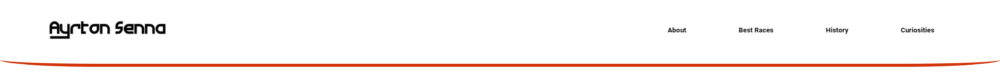
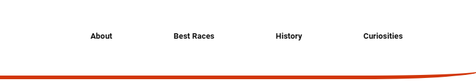
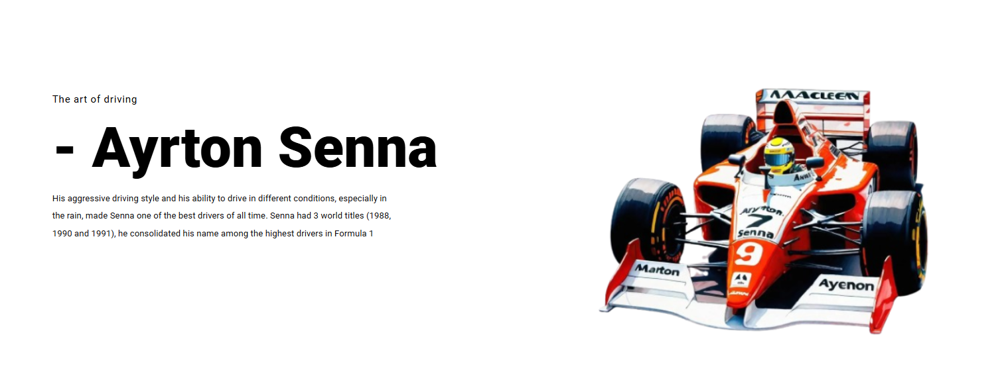
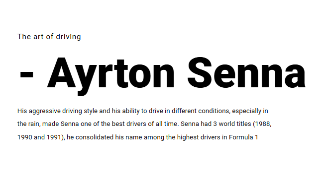
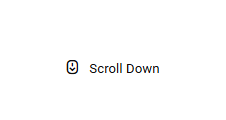

# AYRTON SENNA 🏎️

<p align="center">
  
</p>


> *OBS: Este é um repositório desenvolvido durante o desafio do curso de Geração Tech Unimed-BH | Fullstack da [DIO](https://www.dio.me/) e com ajuda do Canal [Tahmid Ahmed](https://youtu.be/EU2xgn350EM?si=KQJgESEbjpyJbSOM)* 

## Sumário
- Resumo ✍🏻
- Linguagem 💻
- Palavras Chaves 🤓
- Explicação dos Códigos 🚀
    1. HTML
        - head
        - header
        - section
        - body
    2. CSS
        - seletor universal
        - :root
        - main-header
        - logo
        - top-buttons
        - text
        - main-text
        - scroll
        - @media
- Conclusão 🐜


## Resumo ✍🏻
Esse projeto é um protótipo que tem o objetivo de entender melhor o uso do HTML e CSS, em um teste prático do que seria montar um site do 0 e ao mesmo tempo fazer uma homenagem ao piloto brasileiro Senna.

Para concluir o desafio foi necessário ajuda tanto dos conhecimentos trazidos pelo curso quanto do tutorial do [Youtube](https://youtu.be/EU2xgn350EM?si=KQJgESEbjpyJbSOM), o intuito desse repositório é armazenar os conhecimentos afim de concretiza-los na mente.

## Linguagem 💻

A linguagem utilizada nesse protótipo foi o HTML e CSS:

<div align="left">
  
</div>

E estamos utilizando o *Apache*, (Servidor HTTP Apache), é um servidor de código aberto no qual possibilita que donos de sites mostrem e mantenham seus conteúdos na internet:

<div align="left">
  
</div>

## Palavras Chaves 🤓

### - HTML
`<!DOCTYPE html>`: Declara que o documento é um HTML5;

`<html>`: Contém todo o conteúdo da página;

`<head>`: Inclui metadados como título, links para estilos e fontes;

`<body>`: Contém o conteúdo visível da página, como texto e imagens;

`<meta>`: Define configurações, como codificação de caracteres;

`<link>`: Conecta arquivos externos, como CSS ou fontes;

`<div>`: Define uma divisão/seção, o elemento div é normalmente usado como um contêiner para outros elementos, facilitando na estilização de blocos (CSS);

`<h1>` a `<h6>`: Cabeçalhos de diferentes tamanhos, com o h1 sendo o maior deles;

`<p>`: Representa parágrafos;

`<ul>` e `<li>`: Listas não ordenadas e itens, respectivamente;

`<a>`: Links clicáveis;

``: Insere imagens;

`<i>`: Define ícones.

A imagem abaixo (*box model*) explica melhor visualmente cada elemento do HTML que utilizamos na estilização no CSS:

<p align="center">
  
</p>

## Explicação dos Códigos 🚀

### HTML

#### *- head*
```
    <head>
        <meta charset="utf-8">
        <title>Life of Ayrton Senna</title>
        <link rel="stylesheet" href="style.css">
        
        <!-- box icons link-->
        <link rel="stylesheet"
        href="https://unpkg.com/boxicons@latest/css/boxicons.min.css">
        
        <!--remix icons link-->
        <link
        href="https://cdn.jsdelivr.net/npm/remixicon@4.5.0/fonts/remixicon.css"
        rel="stylesheet"
        />
        
        <!--google fonts link-->
        <link rel="preconnect" href="https://fonts.googleapis.com">
        <link rel="preconnect" href="https://fonts.gstatic.com" crossorigin>
        <link href="https://fonts.googleapis.com/css2?family=Roboto:ital,wght@0,100;0,300;0,400;0,500;0,700;0,900;1,100;1,300;1,400;1,500;1,700;1,900&display=swap" rel="stylesheet">
    </head>
```
`<meta charset="utf-8">`: Isso garante que caracteres especiais (como acentos ou símbolos) sejam exibidos;

`<title>Life of Ayrton Senna</title>`: Esse é o título que vai aparecer na aba do navegador;

`<link rel="stylesheet" href="style.css">`: Importa um arquivo CSS local chamado style.css, no qual contém estilos personalizados para a página;

`<!--links-->`: Importa pacotes de ícones ou fontes a partir de um servidor externo, você consegue esses códigos nos próprios sites.

*OBS:* Todos os códigos á seguir estão dentro do `<body>`

---

#### *- header*
```
        <!--header-->
        <header class="main-header">
            <a href="#" class="logo">
                
            </a>
            <ul class="top-buttons">
                <li><a href="#"><b>About</b></a></li>
                <li><a href="#"><b>Best Races</b></a></li>
                <li><a href="#"><b>History</b></a></li>
                <li><a href="#"><b>Curiosities</b></a></li>
            </ul>  
        </header>
```
`<header class="main-header">`

- A classe `main-header` aplica estilos específicos (via CSS) ao cabeçalho (header).

---

```
<a href="#" class="logo">
    
</a>
```
- O elemento `<a>` cria um link e o atributo href="#" indica que, ao clicar, a pessoa não será redirecionado a outra página (por enquanto, é um link vazio por conta do #);

- O `` exibe uma imagem no local indicado pelo atributo `src`, nesse caso a imagem está armazenada localmente.

---

`<ul class="top-buttons">`

- O `<ul>` é uma lista não ordenada (unordered list). Os itens dentro dela são representados pelas tags `<li>`.

---

`<li><a href="#"><b>About</b></a></li>`

- Cada `<li>` representa um item da lista;

- O `<b>` deixa o texto em negrito.

---

#### *- section*
```
        <!--Text-->
        <section class="text">
            <div class="main-text">
                <h5>The art of driving</h5>
                <h1>- Ayrton Senna</h1>
                <p>His aggressive driving style and his ability to drive in different conditions, especially in the rain, made Senna one of the best drivers of all time. Senna had 3 world titles (1988, 1990 and 1991), he consolidated his name among the highest drivers in Formula 1</p>
            </div>

            <div class="img-text">
                
            </div>
        </section>
```

```
<div class="main-text">
    <h5>The art of driving</h5>
    <h1>- Ayrton Senna</h1>
    <p>His aggressive driving style and his ability to...in Formula 1</p>
</div>
```
- `<h5>`: Adiciona um título menor ou subtítulo;

- `<h1>`: Usado para o título principal da seção;

- `<p>`: Usado para parágrafos.

---

#### *- body*
```
        <div class="scroll">
            <a href="#">
                <i class="ri-scroll-to-bottom-line"></i>
                Scroll Down
            </a>
        </div>
```

`<div class="scroll">`

- O atributo `class="scroll"` indica que esse contêiner pertence a uma classe chamada scroll;

---

`<i class="ri-scroll-to-bottom-line"></i>`

- A classe ri-scroll-to-bottom-line faz parte de uma biblioteca de ícones;

-Neste caso, o ícone "scroll-to-bottom-line" representa visualmente a ação de rolar para baixo.

---

`Scroll Down`

- Esse é um texto visível do link. Serve como um indicativo para o usuário de que clicar aqui rolará a página para baixo.

---

### CSS

#### *- seletor universal*
```
*{
    padding: 0;
    margin: 0;
    box-sizing: border-box;
    list-style: none;
    text-decoration: none;
    font-family:"Roboto", sans-serif;
}
```
- O seletor universal `(*)` significa que as regras aplicadas serão válidas para todos os elementos do documento HTML;

- `padding: 0`: Remove qualquer preenchimento interno (espaço entre o conteúdo de um elemento e suas bordas);

- `margin: 0`: Remove qualquer margem externa (espaço ao redor do elemento);

---

`box-sizing: border-box`

- Altera o comportamento do modelo de caixa (box model) para incluir o padding e a borda dentro das dimensões totais de largura e altura definidas.

- Isso facilita o controle das dimensões dos elementos, evita que o padding ou a borda aumentem o tamanho total de um elemento.

---

- `list-style: none`: Remove os estilos padrão de listas (como marcadores ou números) dos elementos `<ul>` e `<ol>`;

- `text-decoration: none;`: Remove sublinhados ou outros estilos de decoração aplicados por padrão aos links e outros elementos de texto;

- `font-family: "Roboto", sans-serif`: Define a fonte padrão do documento como "Roboto", mas se não funcionar será usada sans-serif.

---

#### *- :root*
```
:root{
    --bg-color:#fff;
    --text-color: #0c0c0c;
    --main-color: #d2360a;

    --big-font: 6.4rem;
    --p--font: 1rem;
}
```

`:root`: sendo um  pseudo-seletor ele é usado para definir variáveis globais que podem ser acessadas em qualquer parte do arquivo CSS;

Variáveis CSS são definidas com dois traços `(--)` no início do nome, de depois de um valor;

`rem` é uma unidade relativa ao tamanho da fonte raiz.

---

#### *- main-header*

```
.main-header{
    position: fixed;
    width: 100%;
    top: 0;
    right: 0;
    z-index: 1000;
    padding: 35px 4%;
    display: flex;
    align-items: center;
    justify-content: space-between;
    transition: all .50s ease;
}
``` 
Essa é a visualização dessa parte do código:

<p align="center">
  
</p>

---

`position: fixed`: Define a posição do elemento como fixa em relação à janela de visualização, então o elemento não se move quando rolarem a página;

`width: 100%`: Define a largura do elemento;

`top: 0`: Posiciona o elemento no topo da janela (distância de 0 pixels do topo).

`right: 0`: Alinha o elemento ao lado direito da janela (distância de 0 pixels do lado direito).

`z-index: 1000`: Controla a ordem de empilhamento do elemento. Um valor maior (como por exemplo 1000) garante que o elemento ficará acima de outros elementos na página

---

`padding: 35px 4%`: Define o preenchimento interno do elemento

- <b>35px:</b> Adiciona 35 pixels de espaço na parte superior e inferior do elemento;

- <b>4%:</b> Adiciona 4% de espaço na esquerda e direita do elemento em relação à largura da tela.

---

`display: flex`

- Display é utilizada para indicar a forma como os elementos HTML serão exibidos na página ou em espaços delimitados;

- Quando colocamos flex na propriedade de um elemento, esse elemento se torna um flex container, a partir daí podemos manipular todos os elementos filhos desse flex container com propriedades novas.

---

`align-items: center`: Alinha verticalmente os itens dentro do contêiner no centro.

--- 

`justify-content: space-between`

- Distribui os itens no contêiner com espaço igual entre eles.

- O primeiro item é alinhado à esquerda, o último à direita, e o espaço restante é distribuído igualmente entre os itens intermediários.

---

`transition: all .50s ease`: Define uma transição suave para todas as propriedades que podem mudar (posição, cor, tamanho, e entre outros.);

- <b>.50s:</b> A transição durará 0,5 segundos.

- <b>ease:</b> Aplica uma aceleração/desaceleração suave durante a transição.

---

#### *- logo*
```
.logo img{
    width: auto;
    height: 85px;
    border: #fff solid 17px;
}
```
Essa é a visualização dessa parte do código:

<p align="center">
  
</p>

---

`width: auto`: Define a largura (width) da imagem como automática, ou seja, a largura será calculada automaticamente com base na proporção da imagem ou no espaço disponível na página;

`height: 85px`: Define a altura (height) da imagem como 85 pixels. A largura da imagem vai ser ajustada automaticamente para manter a proporção original (devido ao width: auto).

---

`border: #fff solid 17px`

- <b>border:</b> Adiciona uma borda ao redor da imagem;

- <b>Cor:</b> #fff, ou seja, branco;

- <b>Estilo:</b> solid (sólida, sem ser tracejada ou pontilhada);

- <b>Espessura:</b> 17 pixels.

---

#### *- top-buttons*
```
.top-buttons {
    display: flex;
}
.top-buttons a{
    display: inline-block;
    margin: 0 35px;
    color: var(--text-color);
    font-size: var(--p--font);
    transition: all .6s ease;
    padding: 9px 24px;
    border: 1px solid var(--bg-color);
    border-radius: 7px;
}
.top-buttons a:hover{
    color: var(--main-color)
}
```
Essa é a visualização dessa parte do código:

<p align="center">
  
</p>

---

<b>`.top-buttons a`</b>

- `display: inline-block`: Faz com que os links sejam elementos de bloco em linha;

- `margin: 0 35px`: Adiciona um espaçamento horizontal de 35px entre os links, não tem margem vertical (pois é 0);

- `color: var(--text-color)`: Define a cor do texto dos links;

- `font-size: var(--p--font)`: Define o tamanho da fonte baseado na variável --p--font;

- `transition: all .6s ease`: Adiciona uma transição suave de 0.6 segundos a <b>todas</b> as propriedades animáveis (como cor e borda), usando a função de suavização <b>ease</b>;

---

`padding: 9px 24px`: Define o espaço interno dos links

- 9px no topo e na parte inferior;
24px nas laterais.

---

- `border: 1px solid var(--bg-color)`: Cria uma borda de 1px ao redor dos links, com a cor definida pela variável --bg-color;

- `border-radius: 7px`: Arredonda os cantos da borda com um raio de 7px.

---

<b>`.top-buttons a:hover`</b>

- `hover`: Este seletor aplica os estilos quando o usuário passa o mouse sobre um link;

---

#### *- text*
```
.text{
    position: relative;
    width: 100%;
    height: 100vh;
    align-items: center;
    display: grid;
    grid-template-columns: repeat(2, 1fr);
    gap: 2rem;
}
```
Essa é a visualização dessa parte do código:

<p align="center">
  
</p>

---

`position: relative`: Define que o elemento .text terá uma posição relativa. Isso significa que ele pode ser posicionado em relação à sua posição padrão (sem sair do fluxo normal da página);

---

`height: 100vh`: Define a altura do elemento como 100% da altura da viewport (tela visível do navegador);

<b>OBS:</b> vh significa "viewport height"

---

`align-items: center`: Essa propriedade garante que os itens fiquem centralizados verticalmente em suas áreas;

`display: grid`: Define o elemento como um container de grid.

---

`grid-template-columns: repeat(2, 1fr)`: Define a estrutura das colunas no grid

- `repeat(2, 1fr)` cria 2 colunas com larguras iguais.

- `1fr` significa 1 fração do espaço disponível.

---

`gap: 2rem`: Define o espaço entre as colunas e linhas do grid. Neste caso, será de 2rem, onde rem é relativo ao tamanho da fonte raiz do documento.

---
#### *- main-text*
```
.main-text p{
    width: 100%;
    max-width: 620px;
    font-size: var(--p--font);
    font-weight: 400;
    line-height: 32px;
    color: var(--text-color);
    margin-bottom: 40px;
}
```
Essa é a visualização dessa parte do código:

<p align="center">
  
</p>

`max-width: 620px`: A largura máxima do parágrafo será de 620px, mesmo que o elemento pai permita uma largura maior. Isso impede que o texto fique muito espalhado em telas grandes;

---

`font-weight: 400`: Especifica o peso da fonte. O valor 400 corresponde ao peso "normal" da maioria das fontes;

<b>OBS</b>: O peso da fonte, também conhecido como espessura da fonte, refere-se à espessura relativa dos caracteres de uma fonte tipográfica.

---

`line-height: 32px`: Define a altura da linha para 32 pixels; o espaçamento vertical entre as linhas do texto;

`margin-bottom: 40px`: Adiciona uma margem inferior de 40px abaixo do parágrafo, criando um espaço vertical entre ele e o próximo elemento.

---
#### *- scroll*
```
.scroll{
    position: absolute;
    top: 92%;
    right: 7%;
    transform: translateY(-50%);
}
.scroll a{
    font-size: 16px;
    color: var(--text-color);
}
.scroll i{
    font-size: 20px;
    color: var(--text-color);
    margin-right: 6px;
}
```
Essa é a visualização dessa parte do código:

<p align="center">
  
</p>

---

<b>`.scroll`</b>

`position: absolute`: Define que o elemento será posicionado em relação ao elemento pai mais próximo que tenha uma posição relativa, fixa ou absoluta definida.

`top: 92%`: Move o elemento 92% da altura total do pai a partir do topo.

`right: 7%:` Posiciona o elemento 7% da largura total do pai a partir da borda direita.

`transform: translateY(-50%)`: Move o elemento verticalmente para cima em 50% da sua própria altura.

---

#### *- @media*
```
@media(max-width: 1770px){
    header{
        padding: 22px 4%;
    }
    .scroll{
        right: 4%;
    }
}

@media(max-width: 1670px){
    :root{
        --big-font: 5.5rem;
        --p-font: 15px;
    }
}

@media(max-width: 1370px){
    section{
        padding: 0 4%;
    }
}

@media(max-width: 1150px){
    :root{
        --big-font: 4.6rem;
    }
}
```

Um exemplo para entender todo os outros códigos que seguem quase o mesmo padrão é:

`@media(max-width: 1770px)`
<b>OBS:</b>Esta regra será aplicada apenas para telas com largura máxima de 1770 pixels.

Assim terão "regras" específicas para cada largura da página.

## Conclusão 🐜

Este projeto representou uma excelente oportunidade para consolidar os fundamentos de HTML e CSS, explorando a criação de um site do zero e homenageando um dos maiores ícones do automobilismo, Ayrton Senna 🏎️. Durante o processo, foi possível compreender melhor o que de fato eu estava fazendo, porém outros como o modelo de caixa (box model), display: grid, ficaram "embasados" ainda, porém nada que um estudo junto a uma escrita de artigo não auxilie.

Além disso, a experiência destacou a importância do planejamento e organização no desenvolvimento web. A separação das seções e o uso de boas práticas, como o seletor universal e as transições suaves, contribuíram para a construção de uma interface limpa e funcional.

Por fim, ao associar conhecimentos teóricos do curso com práticas reais e recursos de terceiros, o projeto não só homenageia Ayrton Senna, mas também serve como um marco de aprendizado e evolução no meu inicio de domínio da tecnologias web.

Este repositório é um passo importante na jornada de desenvolvimento e com certeza terá atualizações, assim espero 🏁.

---
//Feito por Luke 🐉//
